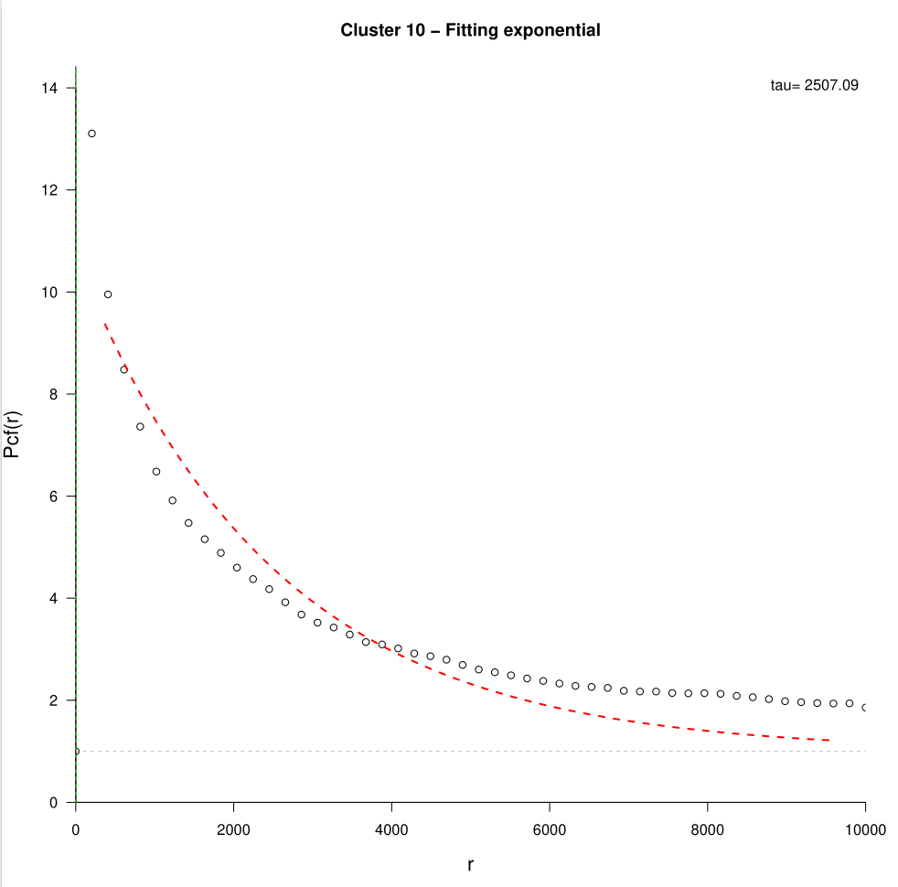
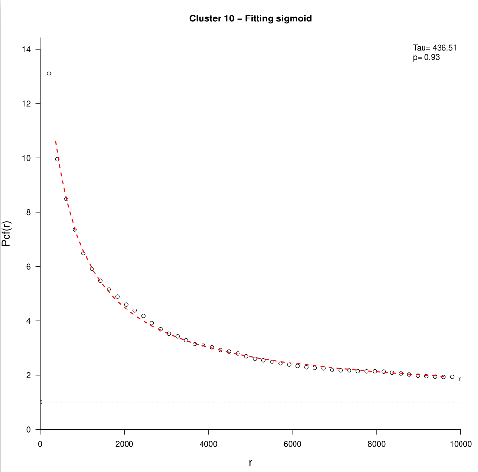

 # PCFSiM Tutorial

This tutorial provides a step-by-step guide on how to use the PCFSiM library for analyzing spatial point patterns in single-cell data. We have provided as Example data a [CosMx Human Frontal Cortex dataset](https://nanostring.com/products/cosmx-spatial-molecular-imager/ffpe-dataset/human-frontal-cortex-ffpe-dataset/).

## Step 1: Load Metadata

First, we need to load the metadata containing for each observation (here cells), information about the location on both axis and the label associated (here the cluster of each cell).

```R
Meta_data = read.csv('Example_data/Frontal_cortex_data.csv')
```

## Step 2: Create SCE Object

Next, we create a SingleCellExperiment (SCE) object using the loaded metadata. We specify the columns for cell centroids and clustering.

```R
sce = Create_sce_object(Meta_data,cell_centroid_x = "cell_centroid_x",cell_centroid_y = "cell_centroid_y",Clustering = "Clustering")
```

## Step 3: Compute Pair Correlation Function (PCF)

Now, we compute the pair correlation function (PCF) using the SCE object. We define a range of distances according to the size of the tissue and specify the computation method. 

```R
List_pcf = Compute_pcf(sce, r_vector = seq(0, 10000, length.out = 50), computation_method = "direct", verbose = TRUE)
```
For each cluster, the results consist of 2 lists of equal length, one containing the r distances, the other with the computed PCF values at each distance.

```R
# Example for cluster 1
> List_pcf$List_r[[1]]
 [1]     0.0000   204.0816   408.1633   612.2449   816.3265  1020.4082  1224.4898  1428.5714  1632.6531  1836.7347
[11]  2040.8163  2244.8980  2448.9796  2653.0612  2857.1429  3061.2245  3265.3061  3469.3878  3673.4694  3877.5510
[21]  4081.6327  4285.7143  4489.7959  4693.8776  4897.9592  5102.0408  5306.1224  5510.2041  5714.2857  5918.3673
[31]  6122.4490  6326.5306  6530.6122  6734.6939  6938.7755  7142.8571  7346.9388  7551.0204  7755.1020  7959.1837
[41]  8163.2653  8367.3469  8571.4286  8775.5102  8979.5918  9183.6735  9387.7551  9591.8367  9795.9184 10000.0000
> List_pcf$List_pcf[[1]]
 [1]      Inf 2.316006 2.319996 2.320791 2.314586 2.302970 2.298097 2.295581 2.289330 2.282822 2.275866 2.269633
[13] 2.267929 2.258033 2.252165 2.242558 2.231161 2.223281 2.217886 2.208093 2.203889 2.194876 2.186921 2.177837
[25] 2.165261 2.156259 2.147899 2.138092 2.128085 2.119321 2.109654 2.100618 2.087569 2.078641 2.070464 2.060627
[37] 2.049533 2.039763 2.028423 2.018728 2.007578 1.998215 1.987032 1.977078 1.964774 1.954931 1.945353 1.933477
[49] 1.922903 1.864913
> List_pcf$Annotation
   ROI Cluster
1    1       1
2    1       2
3    1       3
4    1       4
5    1       5
6    1       6
7    1       7
8    1       8
9    1       9
10   1      10
11   1      11
12   1      12
13   1      13
14   1      14
```
## Step 4: Fit Models for a Specific Cluster

We can fit different models to the PCF data for a specific cluster. In this example, we will fit models for cluster `k = 10`.

```R
k = 10
x = List_pcf$List_r[[k]]
y = List_pcf$List_pcf[[k]]

m_expo = try(Fit_exponential(x,y,show_plot = TRUE))
m_sigmoid = try(Fit_sigmoid(x,y,show_plot = TRUE))
```
<div style="display: flex; gap: 50px;">
  
  
</div>

## Step 5: Retrieve Fitting Results for All Clusters

We can retrieve fitting results for all clusters using different parametric models.

```R
Results_sigmoid = Fit_parametric_pcf_model(List_pcf, model = "Sigmoid")
Results_gamma = Fit_parametric_pcf_model(List_pcf, model = "Gamma")
Results_exponential = Fit_parametric_pcf_model(List_pcf, model = "Exponential")
```

## Step 6: Compare Models with Boxplots

To compare the performance of the fitted models, we can create boxplots.

```R
Model_comparison_boxplot(list_results = list(Model_Sigmoid = Results_sigmoid,Model_Gamma = Results_gamma,Model_exponential = Results_exponential))
```

## Step 7: Plot Selected Cluster

Finally, we can visualize a specific cluster. In this example, we will plot cluster `2`.

```R
Plot_selected_cluster(Meta_data = Meta_data, selected_cluster = 2, title_show = "Cluster 2")
```

